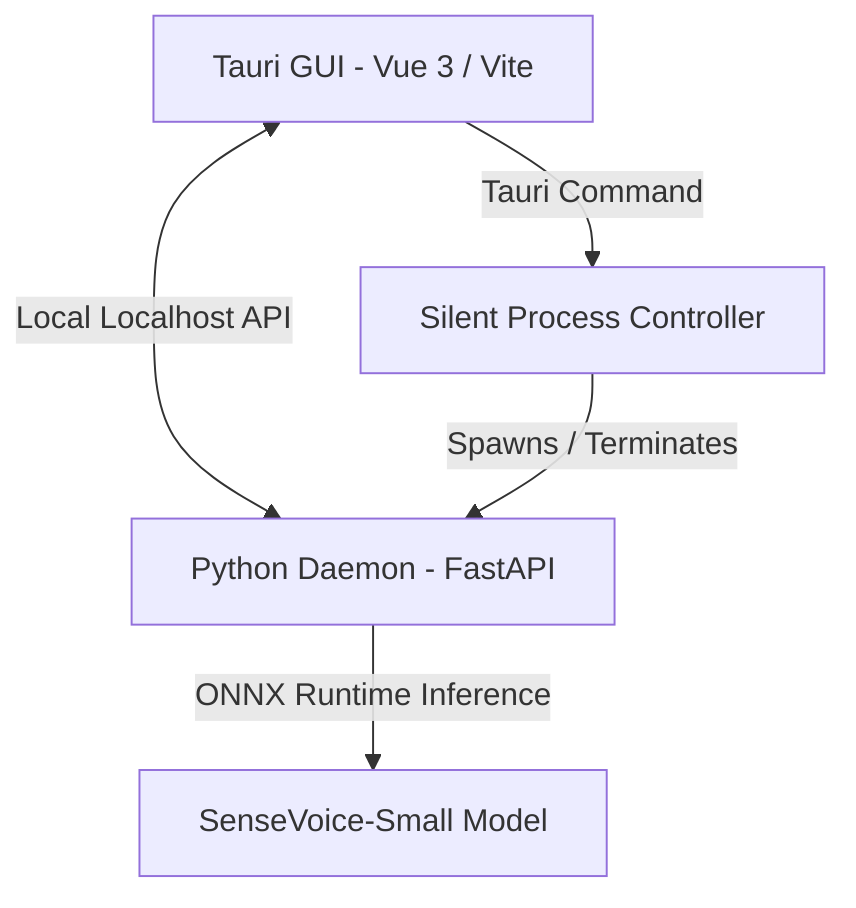

<p align="center">
  
</p>

<h1 align="center">Shiyu Subtitle</h1>

<p align="center">
  <strong>An ultra-fast, lightweight, and 100% offline local AI subtitle assistant powered by Tauri, Vue 3, and SenseVoice-Small.</strong>
</p>

<p align="center">
  <a href="README.zh-CN.md">简体中文</a> | <span>English</span>
</p>

---

### Application Preview

<p align="center">
  
</p>

---

Shiyu Subtitle is an ultra-fast, lightweight, and 100% offline local AI subtitle assistant designed for creators, developers, and power users. By combining the high-performance speech recognition of SenseVoice-Small with the modern, efficient Tauri + Vue 3 desktop framework, Shiyu delivers a premium, distraction-free subtitle generation and editing experience directly on your local machine.

### Key Features

* **100% Local & Private**: No cloud API keys, no network required. Your audio, video, and transcripts never leave your machine.
* **SenseVoice-Small Powered**: Ultra-fast voice-to-text inference utilizing optimized ONNX Runtime. Compresses 1 hour of audio transcription into less than 1 minute.
* **Smart Speech Segmentation**: Advanced bilingual segmenting algorithms for natural, human-readable line breaks, bypassing model-native limitations.
* **Temporal Offset Compensation**: Integrated -150ms latency compensation, perfectly aligning subtitles to the audio waveform and correcting SenseVoice CTC peak delays.
* **Modern & Sleek UI**: A premium dark-mode glassmorphism interface featuring smooth micro-animations, synchronized wave previews, and seamless timing navigation.
* **Silent Daemon Management**: Seamless, headless backend process lifecycle control. The Python API starts and terminates invisibly alongside the Tauri GUI—no annoying command prompt windows.
* **CI/CD Ready**: Ready-to-go GitHub Actions configuration for automated multi-platform compilation (Windows, macOS, and Linux) with platform-native Python packaging.

---

### System Architecture



* **Frontend**: Vue 3, Vite, Naive UI, Lucide Icons, Web Audio API
* **Tauri Core**: Rust (System windowing, silent process daemonization, registry isolation)
* **Backend**: FastAPI, Uvicorn, Python 3.10, ONNX Runtime (SenseVoice inference)

---

### Quick Start (Local Development)

#### Prerequisites
* **Node.js** (v18+) & **npm**
* **Rust** (stable toolchain)
* **Python** (3.10.x recommended)

#### 1. Setup Backend
1. Clone the repository and navigate to the backend folder:
   ```bash
   cd backend
   ```
2. Create a virtual environment and activate it:
   ```bash
   python -m venv venv
   # On Windows:
   .\venv\Scripts\activate
   # On macOS/Linux:
   source venv/bin/activate
   ```
3. Install dependencies:
   ```bash
   pip install -r requirements.txt
   ```
4. Verify the model directory exists at `models/sensevoice-small/` containing `model.onnx`.

#### 2. Setup Frontend & Run Dev
1. Navigate to the frontend directory:
   ```bash
   cd ../frontend
   ```
2. Install Node dependencies:
   ```bash
   npm install
   ```
3. Run the application in development mode:
   ```bash
   npm run tauri dev
   ```

---

### Packaging and Releasing

This repository includes a professional GitHub Actions workflow located at `.github/workflows/release.yml`. 

To compile and package installers for Windows (.msi/.exe), macOS (.dmg), and Linux (.deb) simultaneously:
1. Push your code to GitHub.
2. Create and push a version tag:
   ```bash
   git tag v1.0.0
   git push origin v1.0.0
   ```
3. The runner will download Git LFS models, compile Rust code, bundle native Python environments, and publish draft installers to your GitHub Releases.

---

### License

This project is licensed under the [MIT License](LICENSE).
