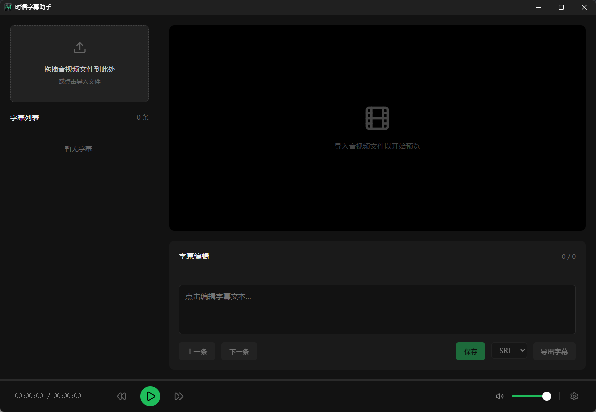
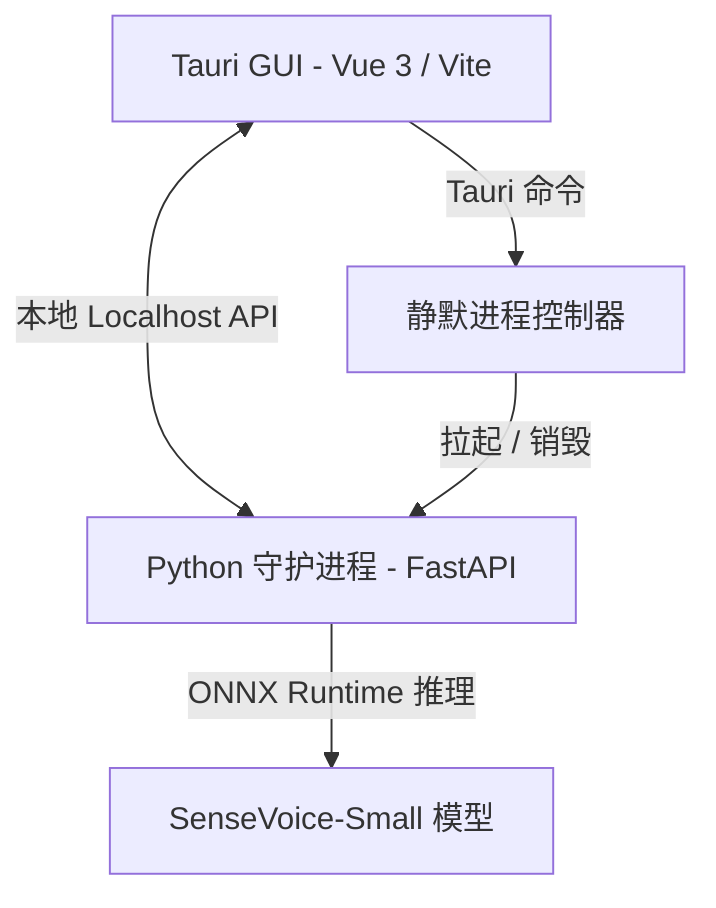

<p align="center">
  
</p>

<h1 align="center">时语 Shiyu Subtitle</h1>

<p align="center">
  <strong>基于 Tauri + Vue 3 + SenseVoice-Small 的极速、轻量级 100% 离线本地 AI 字幕生成与精修助手。</strong>
</p>

<p align="center">
  <span>简体中文</span> | <a href="README.md">English</a>
</p>

---

### 界面预览

<p align="center">
  
</p>

---

时语字幕助手 (Shiyu Subtitle) 是一款为创作者、开发者与极客打造的极速、轻量级、100% 离线本地 AI 字幕助手。它将阿里巴巴开源的 SenseVoice-Small 高性能语音识别能力，与现代高效的 Tauri + Vue 3 桌面端架构完美融合，旨在为您提供最纯粹、私密且极其流畅的本地字幕生成与精修体验。

### 核心特性

* **100% 本地私密安全**：无需云端 API 密钥，无需联网。您的音视频数据与文本绝不上云，彻底杜绝隐私泄露。
* **SenseVoice-Small 驱动**：基于深度优化的 ONNX Runtime 进行本地推理。1 小时的音频可在 1 分钟内极速识别完毕。
* **智能断句与排版**：内置中英文双语高精度智能断句算法，彻底解决语音模型原生的长句粘连问题，排版更符合人类阅读习惯。
* **CTC 峰值时值补偿**：自动应用精准的 -150ms 时间戳偏移补偿，完美对齐声音波形，消除语音模型特有的 CTC 峰值延迟。
* **现代极简美学 UI**：精心打磨的深色磨砂玻璃微动效界面，配合波形同步预览、点击时间码快捷跳转与顺滑的快捷键精修体验。
* **静默后台守护管理**：采用 Rust 原生句柄控制，自动、无框、无感地随 GUI 启动或终止 Python 识别服务，告别烦人的黑框。
* **企业级 CI/CD 支持**：预置高水准 GitHub Actions 自动构建脚本，一键在云端自动编译出 Windows (.msi)、macOS (.dmg) 和 Linux (.deb) 原生安装包。

---

### 技术架构

时语采用高性能的前后端分离桌面架构：


* **前端 (GUI)**：Vue 3, Vite, Naive UI, Lucide Icons (负责交互与音视频时间轴控制)
* **Tauri 核心**：Rust (负责系统级窗口操作、后台 Python 静默守护进程拉起与注册表隔离)
* **后端 (推理引擎)**：FastAPI, Uvicorn, Python 3.10 (负责调用 ONNX 引擎执行 SenseVoice 本地推理)

---

### 快速开始 (本地开发)

#### 环境准备
* **Node.js** (v18+) 及 **npm** 包管理工具
* **Rust** 编译器 (Stable toolchain)
* **Python** 环境 (推荐 3.10.x)

#### 1. 初始化 Python 后端
1. 进入后端目录：
   ```bash
   cd backend
   ```
2. 创建并激活虚拟环境：
   ```bash
   python -m venv venv
   # Windows 系统:
   .\venv\Scripts\activate
   # macOS / Linux 系统:
   source venv/bin/activate
   ```
3. 安装依赖：
   ```bash
   pip install -r requirements.txt
   ```
4. 请确保 `models/sensevoice-small/` 目录下已放置 `model.onnx` 模型文件。

#### 2. 初始化前端并启动开发服务
1. 进入前端目录：
   ```bash
   cd ../frontend
   ```
2. 安装依赖：
   ```bash
   npm install
   ```
3. 启动开发版软件：
   ```bash
   npm run tauri dev
   ```

---

### 打包与发布

本项目支持基于 GitHub Actions 的一键自动打包：
1. 将您的代码推送到 GitHub。
2. 在本地创建并推送版本 Tag：
   ```bash
   git tag v1.0.0
   git push origin v1.0.0
   ```
3. GitHub 虚拟机将自动下载 Git LFS 托管的模型文件，分别在原生系统下构建，并在 Releases 中自动生成各平台的草稿包！

---

### 开源协议

本项目基于 [MIT 开源协议](LICENSE) 授权。
